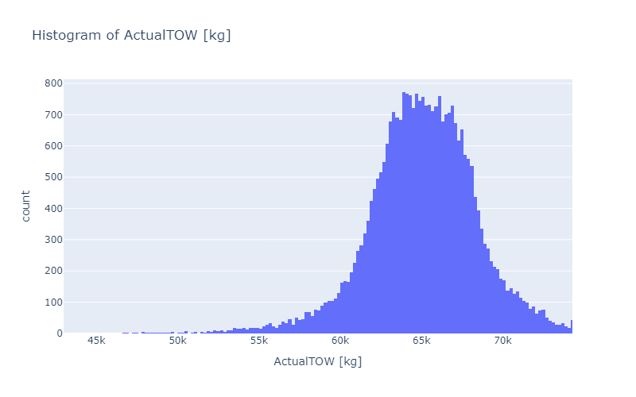
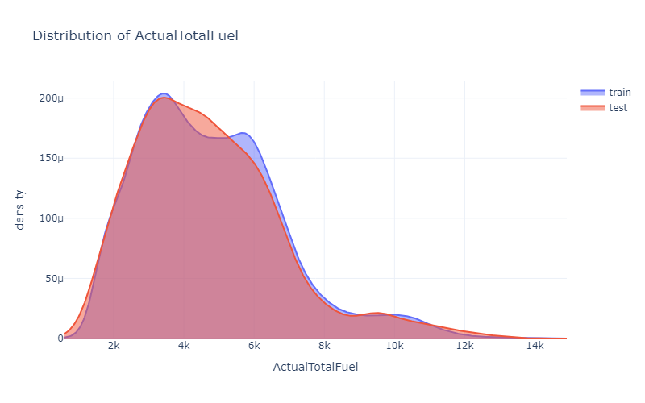
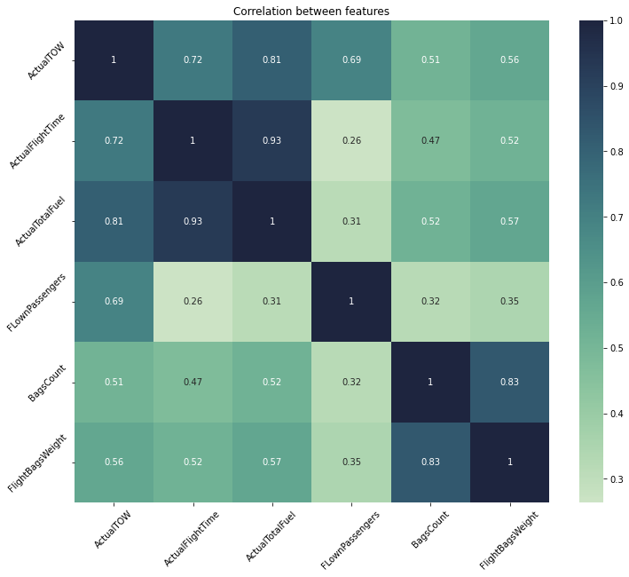
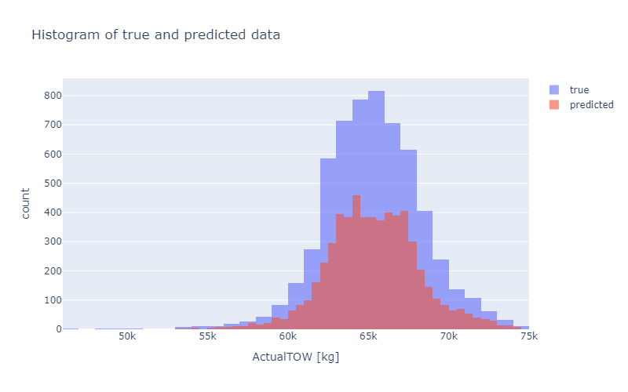

# Take-Off Weight Prediction for Ryanair Flights
## 1. Project Overview
This project aims to build a regression model that predicts the **Take-Off Weight (TOW)** of an aircraft. The dataset includes Ryanair flights from 01.10.2016 to 15.10.2016. The model is evaluated using **Root Mean Squared Error (RMSE)** on a separate validation dataset.

## 2. Exploratory Data Analysis
Records count in training set: 29 731.
Records count in validation set: 1878.

### 2.1 Data quality
Both datasets contain missing values in the `FLownPassengers`, `BagsCount`, and `FlightBagsWeight` columns.

In the `DepartureDate` column, the day part of the date differs from the `DepartureDay` in two records.

In the training dataset, records with missing values in the `ActualTOW` column were removed.

### 2.2 Feature distribution
The distribution of the target variable was checked.

The distribution of numerical variables was also analyzed and compared between the training and validation sets (an example plot for `ActualTotalFuel` is shown below). 

### 2.3 Correlation analysis
Correlation heatmap with `ActualTOW`:

## 3. Data processing
### 3.1 Missing values handling

Assuming the data is ordered chronologically (although this cannot be confirmed due to the lack of time-related information), missing values were filled using a cascading approach based only on historical data (not the entire dataset) to prevent data leakage, as follows:

- `FLownPassengers`: filled using the median number of passengers by route → arrival airport → departure airport → all data,
- `BagsCount`: imputed based on the average number of bags per passenger,
- `FlightBagsWeight`: imputed based on the bag count.

If route data was unavailable in the history, a fallback strategy using arrival airport → departure airport → all data was applied. Missing values in the validation set were filled using historical data from the training set.

## 4. Feature engineering

From a business and practical perspective, the following features were considered as potential predictors: `Route`, `ActualFlightTime`, `ActualTotalFuel`, `FLownPassengers`, `BagsCount`, and `FlightBagsWeight`.

Due to a high correlation (> 0.9) between `ActualFlightTime` and `ActualTotalFuel`, only the feature more strongly correlated with the target variable and with no missing values (`ActualTotalFuel`) was selected.

The categorical variable was encoded using `OrdinalEncoder` because the validation set contains categories not present in the training set.

## 5. Modeling

### 5.1 Models tested
- Linear Regression
- Ridge Regression
- Lasso Regression
- Random Forest Regressor
- XGBoost Regressor

### 5.2 Hyperparameter optimization

Hyperparameter tuning was performed using **Optuna** (50 trials) with a custom search space for each model.   The first 80% of the training dataset was used with **5-fold cross-validation**, considering the temporal nature of the data.

For each model, the best-performing parameters were saved in the `best_models_params.json` file.

### 5.3 Evaluation
All models were evaluated on the validation set (the last 20% of the training data).  
RMSE was compared for all models trained with the best hyperparameters and selected features (see table below). Additionally, histograms of actual vs. predicted values were compared.

| model                   | RMSE    |
|-------------------------|---------|
| Linear Regression       | 1238.46 |
| Ridge Regression        | 1238.46 |
| Lasso Regression        | 1238.46 |
| Random Forest Regressor | 1185.91 |
| XGBoost Regressor       | 1102.31 |

Visual comparison of predicted vs. actual TOW for the validation set using the best-performing model (XGBoost Regressor).

## 6. Final submission

- Selected model: **XGBoost Regressor**
- `results/predictions.csv` with predicted TOW values for validation set.